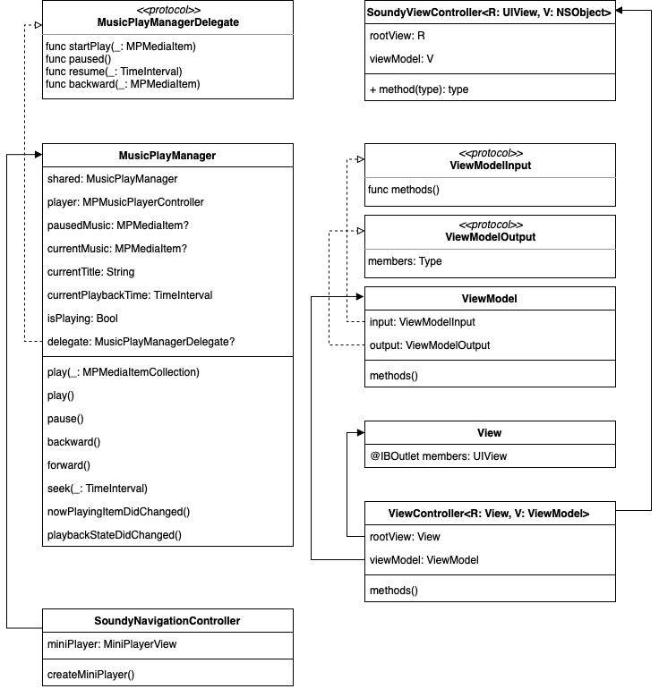
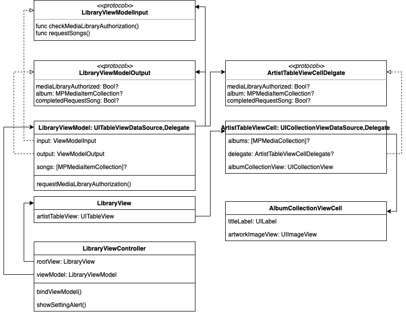
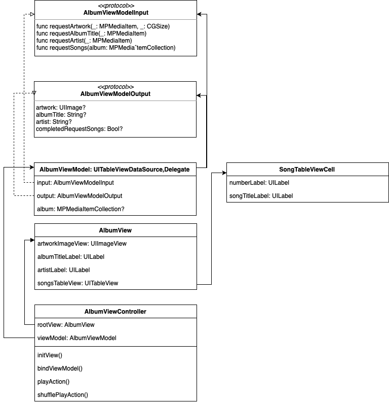
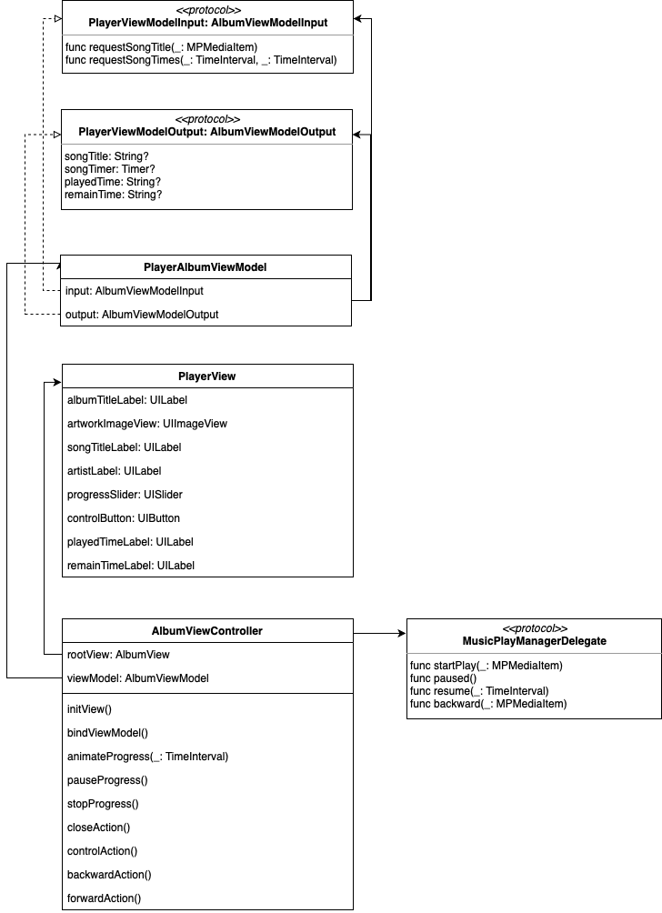

# Soundy

## 개발환경
- MacOS 11.0 BigSur Beta
- Xcode12 Beta 4
- iOS14 Beta 6

## 출시노트
1.1.0
- 백그라운드에서 돌아올 때 플레이 시간 progress가 초기화 되는 오류 수정
- Player에서 탐색 기능 오류 수정
- MiniPlayer와 Player의 싱크 오류 수정
- 곡을 여러번 선택할 때 비정상 종료 오류 수정
  
1.0.0
- Soundy 구현 완성

## Overview
Soundy의 전반적인 설계 다이어그램 입니다. 1.0.0 버전을 기준으로 작성되어 있습니다.

## Library
Library의 MVVM 설계 다이어그램 입니다. MediaPlayer를 이용해 음악 파일을 불러와 아티스트별 앨범들을 표시합니다.

## Album
Album의 MVVM 설계 다이어그램 입니다. Library에서 앨범을 선택하면 Album으로 이동합니다. 선택한 앨범의 아트워크, 아티스트, 앨범명을 상단에 표시하고, 곡 목록을 표시합니다.

## Player
Player의 MVVM 설계 다이어그램 입니다. 하단의 미니 플레이어를 탭하면 Player로 이동합니다. 플레이 중인 곡의 앨범명, 아트워크, 곡명, 아티스트, 플레이된 시간, 남은 시간을 표시합니다.  
요구사항 중 볼륨 컨트롤은 구현하지 않았습니다.이유는 시스템에서 제공하는 볼륨 컨트롤과 중복되기 때문입니다.

